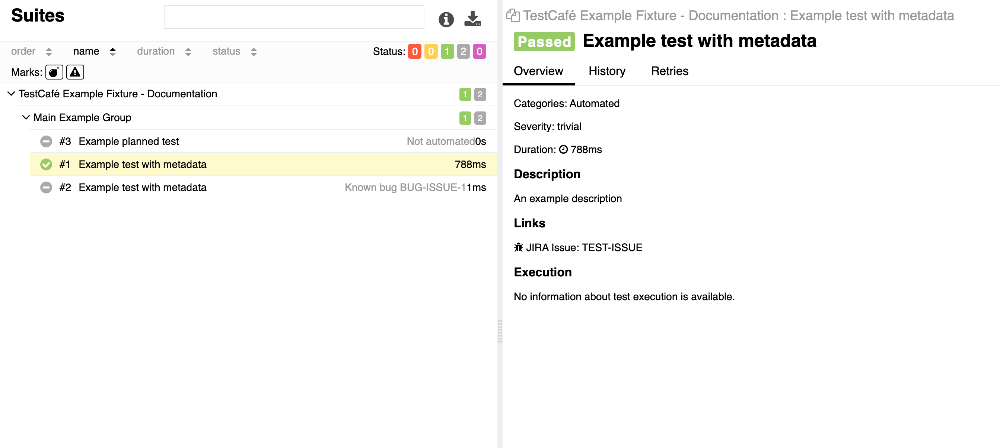
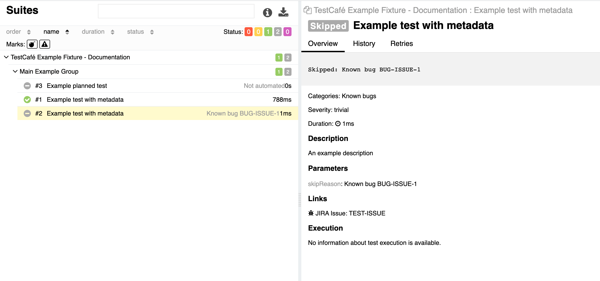
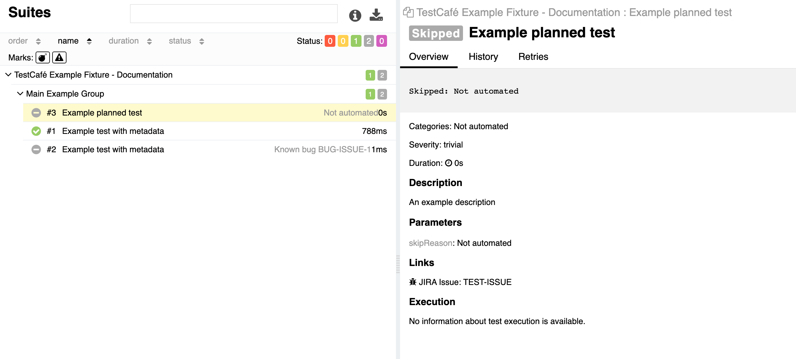
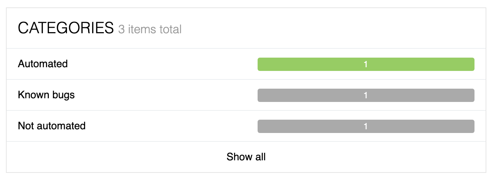

# Metadata

Metadata can be added to a test by using the `meta()` function. The metadata can be added to both the `test` and the `fixture`.

Metadata added to a `fixture` will be inherited by all tests coupled to that fixture to avoid having to declare metadata that is the same for all tests within the fixture multiple times. 

```js
import { t } from 'testcafe';
import { Severity } from 'testcafe-reporter-allure';

fixture('TestCafé Example Fixture - Documentation').page('http://devexpress.github.io/testcafe/example')

test.meta({
  severity: Severity.TRIVIAL,
  issue: 'TEST-ISSUE',
  description: 'An example discription',
  epic: 'Example Epic Ticket',
  feature: 'Example Feature Ticket',
  story: 'Example Story Ticket',
  suite: 'Main Example Group',
  // ... any other key: value property as custom metadata
})('Example test with metadata', async (t) => {
  // Test Code
});

// Skipped test example
test.meta({
    severity: Severity.TRIVIAL,
    issue: 'TEST-ISSUE',
    description: 'An example discription',
    epic: 'Example Epic Ticket',
    feature: 'Example Feature Ticket',
    story: 'Example Story Ticket',
    suite: 'Main Example Group',
    skipReason: 'Skipped: Known product bug BUG-ISSUE-1'
    // ... any other key: value property as custom metadata
}).skip('Example test with metadata', async (t) => {
    // Test Code
});

// Skipped test example
test.meta({
    severity: Severity.TRIVIAL,
    issue: 'TEST-ISSUE',
    description: 'An example discription',
    epic: 'Example Epic Ticket',
    feature: 'Example Feature Ticket',
    story: 'Example Story Ticket',
    suite: 'Main Example Group',
    skipReason: 'Skipped: Not implemented'
    // ... any other key: value property as custom metadata
}).skip('Example planned test', async (t) => {
    // Test Code
});
```

## Pré-defined metadata

| Metadata | Description |
| ------------- | ------------- |
| Severity | The severity values are dictated by the [allure-js-commons](https://github.com/allure-framework/allure-js/tree/main/packages/allure-js-commons) package, these values are: `blocker, critical, normal, minor, trivial`;  |
| Issue  | A Jira Issue can be coupled to a test, creating a link within the Allure Report to the Jira Issue page. The URL to the Jira page can be set in the [allure-js-commons](https://github.com/isaaceindhoven/testcafe-reporter-allure#configuration).  |
| Epic, Feature, Story  | To sort the tests based on the `epic`, `feature`, and/or `story`, these metadata options can be used to form a tree structure. The tree is structured as follows: An epic can have multiple features, a feature can have multiple stories, and a story can have multiple tests. |
| Suite  | Within the Allure Report, the tests are organized by `fixture` by default. For a more expansive organization of the tests and fixtures, the `suite` parameter can be set. When the `suite` parameter is set within a `test`, a subcategory is created within the `fixture` that will group all tests that have the same `suite` parameter together. When the `suite` parameter is set within a `fixture`, a parent category is created that will group multiple fixtures that have the same `suite` parameter.  |
| skipReason  | A test meta tag to allow showing skip reason in allure categories.  |

## Custom metadata

It is also possible to add custom metadata to a `test`. These will be added as parameters to the Allure Report. These parameters do __NOT__ have to be named otherMeta but do require to be a key-value pair of two strings. For example, adding a color parameter to a test: `color: 'black'` will result in `color: black` be added to the final Allure Report.

## Result

### Suite overview

If pré-defined metadata was used as in code example above, it will be added to the allure test result view.

### Example of a test result view for a passed test



### Example of a test result view for a skipped test

Skip reason will be shown as a message on test result overview: 





Skip message can be used as a filter in allure categories view.

## Categories

Example of a custom `allure-categories.config.js` with `skipReason` message to be in `messageRegex` filter: 
```js
module.exports = [
    {
        name: 'Not automated',
        messageRegex: '.*Not automated.*',
    },
    {
        name: 'Known bugs',
        messageRegex: '.*Known bug.*',
    },
    {
        name: 'Automated',
        matchedStatuses: ['failed', 'passed'],
    },
];
```
Using `allure-categories.config.js` with code above and `skipReason` meta in skipped TestCafe tests will produce following categories:


This approach can result in simple code coverage report in your allure results.  
